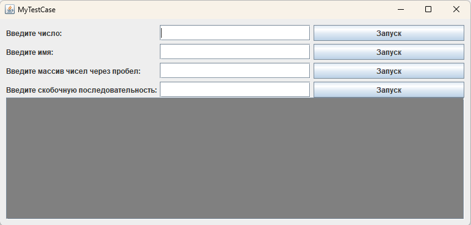

# TestTask

Авилов Java

To build:
mvn clean install

To run:
<path_to_jdk_11>\bin\java.exe -jar <output_jar_file>

For example:

"C:\Program Files\Java\jdk-11.0.2\bin\java.exe" -jar "D:\java\ForTestTask\target\test-task.jar"

main class - org.avilio.App

Дана скобочная последовательность: [((())()(())]]
- Можно ли считать эту последовательность правильной?
- Если ответ на предыдущий вопрос “нет” - то что необходимо в ней изменить, чтоб она стала правильной?

Ответ:

Нет, данную скобочную последовательность нельзя считать правильной. Для правильной скобочной последовательности необходима последовательная вложенность подпоследовательностей, обрамлённых открытой и закрытой скобкой одного типа.
То есть все скобки имеют свои соответствующие пары и правильно вложены.
Например, для данной последовательности: [((())()(())]] существует довольно много вариантов, например :  можно или удалить непарные скобки [(())()(())], или наоборот добавить к ним пары [((()))()(())[]].
В программе реализовал алгоритм, делающий из неправильной последовательности - правильную на основе стэка.
